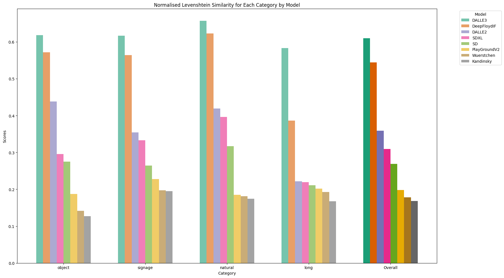

# image-gen-spelling-eval

**Author:** Peter J. Bevan

**Date:** 15/12/23

<a target="_blank" href="https://colab.research.google.com/github/pbevan1/image_gen_ocr_eval/blob/main/image_gen_ocr_evaluation.ipynb">
  
</a>

---

## Overview

This evaluation is used to measure the text output quality of image generation models such as DALLE and Stable Diffusion. The metric calculates the normalised Levenshtein similarity between prompted text and the text present in the generated image (as recognised by OCR).

We present a dataset of 400 prompts, each instructing to include some text in the image. There are 4 categories with 50 prompts in each:

* Objects
* Signage
* Natural
* Long

The default is to use the first 50 of these prompts from each category for each model (200 total).

We provide the ground truth generated text in the dataset. Following generation on the prompt dataset, the scorer is run on the generated images, comparing the target text with the actual text, and outputting a score between 0 and 1. The scores are then averaged to give a benchmark score for each model. A score of 1 indicates a perfect match to the text in every instance.

You can find the dataset at https://huggingface.co/datasets/pbevan11/image_gen_ocr_evaluation_data

Since this metric solely looks at text within the generated images and not image quality as a whole, this metric should be used alongside other benchmarks such as those in https://karine-h.github.io/T2I-CompBench/.

## Install

To clone the project and install dependencies:

```bash
git clone https://github.com/pbevan1/image-gen-spelling-eval
cd image-gen-spelling-eval
pip install requirements.txt
```

## Basic Usage

To generate images and score models:

```bash
python main.py
```

To generate images only:

```bash
python generate_images.py
```

To calculate average scores from responses:

```bash
python calculate_scores.py
```

The below arguments can be appended:

`--model_list`: Defines the models to be tested (models must also be defined in the ImagenHub code to work).

`--DEBUG`: If set to True, generates and evaluates only one image per model.

---
*Table 1: Normalised Levenshtein similarity scores between instructed text and text present in image (as identified by OCR)*

| Model | object | signage | natural | long | Overall |
| --- | --- | --- | --- | --- | --- |
| DALLE3 | 0.62 | 0.62 | 0.62 | 0.58 | 0.61 |
| DeepFloydIF | 0.57 | 0.56 | 0.66 | 0.39 | 0.54 |
| DALLE2 | 0.44 | 0.35 | 0.42 | 0.22 | 0.36 |
| SDTypography | 0.33 | 0.35 | 0.39 | 0.26 | 0.33 |
| SDXL | 0.3 | 0.33 | 0.4 | 0.21 | 0.31 |
| SD | 0.28 | 0.26 | 0.32 | 0.22 | 0.27 |
| PlayGroundV2 | 0.19 | 0.23 | 0.17 | 0.2 | 0.2 |
| Wuerstchen | 0.14 | 0.19 | 0.19 | 0.19 | 0.18 |
| Kandinsky | 0.13 | 0.2 | 0.18 | 0.17 | 0.17 |




```
@misc{image-gen-ocr-eval,
  title = {image_gen_ocr_eval},
  author = {Peter Bevan},
  year = {2024},
  publisher = {HuggingFace},
  journal = {HuggingFace repository},
  howpublished = {\url{https://huggingface.co/datasets/pbevan11/image_gen_ocr_evaluation_data}},
}
```