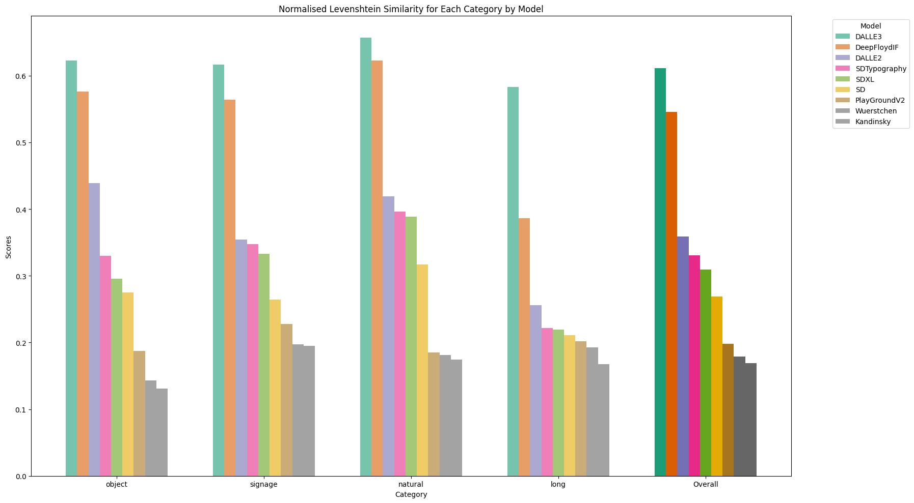

# image_gen_ocr_eval

**Author:** Peter J. Bevan

**Date:** 15/12/23

---

This is a POC that calculates the normalised Levenshtein similarity between prompted text and the text present in the generated image (as recognised by OCR).

To us this to create a metric, we create a dataset of prompts, each instructing to include some text in the image. We also provide a column for ground truth generated text which contains only the instructed text. The below scorer is then run on the generated images, comparing the target text with the actual text, outputting a score. The scores are then averaged to give a benchmark score. A score of 1 indicates a perfect match to the text.

You can find the dataset at https://huggingface.co/datasets/pbevan11/image_gen_ocr_evaluation_data

Since this metric solely looks at text within the generated images and not image quality as a whole, this metric should be used alongside other benchmarks such as those in https://karine-h.github.io/T2I-CompBench/.

Preliminary results for some of the main models below:

